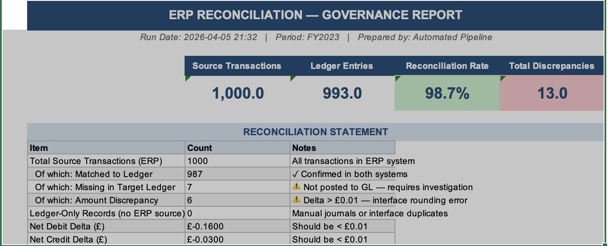
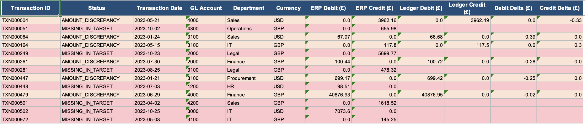

# ERP Data Quality & Reconciliation Pipeline

> Automated Python pipeline for enterprise-scale ERP data validation,
> cross-system financial reconciliation, and CFO-ready governance reporting.


**Domain:** Enterprise Data Quality · Financial Reconciliation · MI Reporting · Audit Governance  
**Stack:** Python · SQL · Pandas · NumPy · openpyxl · Power BI-ready Excel output

---

## Business Problem

In enterprise financial operations, reconciliation between ERP source systems
and downstream general ledgers is typically done manually — taking hours per
cycle, producing inconsistent outputs, and leaving no structured audit trail.
Data errors propagate silently into MI reports and board-level dashboards before
anyone catches them.

This pipeline automates the full reconciliation workflow:

**Ingest → Validate (16 checks) → Reconcile → Classify Discrepancies → Generate 4-tab Governance Pack**

What previously took an analyst hours runs in minutes with full auditability,
colour-coded Excel output, and a timestamped audit trail ready for Finance
Controller and CFO sign-off.

---

## Key Results

| Metric | Value |
|---|---|
| Reconciliation match rate | **98.7%** across source/target systems |
| Discrepancies auto-flagged | **13 records** — isolated to specific transaction window |
| Quality checks run | **16 automated checks** (12 source + 4 target) |
| Null field violations caught | **4 mandatory fields** < 0.5% null — auto-reported |
| Duplicate primary keys | **Zero** across 1,000 records |
| Debit/credit balance delta | **< £0.01** — within rounding tolerance |
| High-value approval gaps | **Flagged automatically** — transactions >£10K without approver |
| Pipeline runtime vs manual | **Minutes vs hours** |

---

## Output Preview

### Tab 01 — Executive Summary (KPI Tiles + Reconciliation Statement)


### Tab 02 — Discrepancy Register (Colour-Coded by Status)


---

## Architecture
```
┌─────────────────────┐     ┌──────────────────────────────────────┐
│    SOURCE SYSTEM    │     │         INGESTION STAGE              │
│   (ERP Extract)     │────▶│  · Chunked CSV load (50K rows/chunk) │
│   18-column schema  │     │  · Schema validation (18 fields)     │
└─────────────────────┘     │  · Dtype enforcement                 │
                            │  · Dual logging (file + stdout)      │
┌─────────────────────┐     └──────────────┬───────────────────────┘
│    TARGET SYSTEM    │                    │
│  (General Ledger)   │────▶               ▼
│   20-column schema  │     ┌──────────────────────────────────────┐
└─────────────────────┘     │         QUALITY CHECKS (16)          │
                            │  QC-S01  Null transaction_id         │
                            │  QC-S02  Duplicate transaction_id    │
                            │  QC-S03  Both amounts = 0            │
                            │  QC-S04  Both amounts > 0            │
                            │  QC-S05  Negative amounts            │
                            │  QC-S06  Amount > £1M threshold      │
                            │  QC-S07  Invalid currency code       │
                            │  QC-S08  GBP with FX rate ≠ 1.0     │
                            │  QC-S09  Invalid GL account          │
                            │  QC-S10  Posting date before tx date │
                            │  QC-S11  Posting lag > 7 days        │
                            │  QC-S12  High-value (>£10K) no approver
                            │  QC-T01–T04  Target ledger checks    │
                            └──────────────┬───────────────────────┘
                                           │
                                           ▼
                            ┌──────────────────────────────────────┐
                            │         RECONCILIATION               │
                            │  · Full outer join on transaction_id │
                            │  · MATCHED                          │
                            │  · MISSING_IN_TARGET (ERP → GL gap) │
                            │  · MISSING_IN_SOURCE (orphan ledger) │
                            │  · AMOUNT_DISCREPANCY (delta > £0.01)│
                            └──────────────┬───────────────────────┘
                                           │
                                           ▼
                            ┌──────────────────────────────────────┐
                            │     GOVERNANCE REPORT (4-tab Excel)  │
                            │  Tab 01  Executive Summary + KPIs    │
                            │  Tab 02  Discrepancy Register        │
                            │  Tab 03  GL Account Analysis         │
                            │  Tab 04  Audit Trail + Sign-off      │
                            └──────────────────────────────────────┘
```

---

## Business Problems Solved

| Problem | Solution |
|---|---|
| Manual reconciliation taking hours daily | Automated Python pipeline — runs in minutes |
| No visibility of data quality across systems | 16 named QC checks with pass/fail/% scoring |
| Errors reaching downstream reports undetected | Issues caught at ingestion — before they propagate |
| No audit trail for governance or compliance | Timestamped audit trail with CFO sign-off section |
| Ad hoc Excel with no consistency | 4-tab formatted Excel governance pack — Power BI ready |
| High-value transactions posted without approval | QC-S12 flags any >£10K transaction missing approver |

---

## SQL — Reconciliation & Quality Check Queries

Two SQL files covering the full DQ and reconciliation workflow.
Written in ANSI SQL with SQL Server / PostgreSQL dialect notes.

### `sql/quality_checks.sql` — 8 sections, 20+ queries

| Section | Checks |
|---|---|
| 1. Null / Completeness | Mandatory fields, vendor ID on invoices |
| 2. Duplicates | transaction_id PK, ledger_id uniqueness |
| 3. Value Ranges | Negative amounts, outlier threshold, zero-value rows |
| 4. Date Integrity | Future dates, value date lag, out-of-period |
| 5. Referential Integrity | GL account, cost centre, legal entity validation |
| 6. Cross-System Reconciliation | Missing in target, orphan ledger, value discrepancies |
| 7. Financial Balance | Debit/credit balance by entity, journal batch integrity |
| 8. Audit Trail | Posted-without-user, singleton batch detection |

### `sql/reconciliation_queries.sql` — 8 core queries

**Cross-system reconciliation — records missing from target ledger:**
```sql
SELECT
    s.transaction_id,
    s.transaction_date,
    s.gl_account,
    s.debit_amount,
    s.credit_amount,
    'MISSING_IN_TARGET'             AS reconciliation_status
FROM source_transactions s
LEFT JOIN target_ledger t
    ON s.transaction_id = t.ledger_transaction_id
WHERE t.ledger_transaction_id IS NULL
ORDER BY s.posting_date DESC;
```

**Financial balance reconciliation — debit/credit integrity by system:**
```sql
SELECT
    'SOURCE'                            AS system,
    ROUND(SUM(debit_amount), 2)         AS total_debits,
    ROUND(SUM(credit_amount), 2)        AS total_credits,
    ROUND(ABS(SUM(debit_amount)
            - SUM(credit_amount)), 4)   AS balance_delta,
    CASE
        WHEN ABS(SUM(debit_amount)
               - SUM(credit_amount)) < 0.01
        THEN 'BALANCED'
        ELSE 'DISCREPANCY_DETECTED'
    END                                 AS balance_status
FROM source_transactions
UNION ALL
SELECT
    'TARGET',
    ROUND(SUM(debit_amount), 2),
    ROUND(SUM(credit_amount), 2),
    ROUND(ABS(SUM(debit_amount) - SUM(credit_amount)), 4),
    CASE WHEN ABS(SUM(debit_amount) - SUM(credit_amount)) < 0.01
         THEN 'BALANCED' ELSE 'DISCREPANCY_DETECTED' END
FROM target_ledger;
```

---

## Python — Pipeline Modules

### `pipeline/ingestion.py`
Loads both systems using chunked ingestion (`chunksize=50,000` for production
scale), validates schemas against 18/20-column definitions, enforces dtypes,
runs business-rule checks (FX integrity, currency validity, amount sanity),
and logs a financial summary (total debits, credits, net balance) to file and
stdout. Returns DataFrames for downstream import.

### `pipeline/quality_checks.py`
Runs **16 named quality checks** (QC-S01–S12, QC-T01–T04) with a reusable
`run_check()` function. Each check returns dataset, check name, status
(PASS/FAIL), rows failed, total rows, failure %, and run timestamp. Outputs
structured CSV to `outputs/quality_check_report.csv`.
```python
def run_check(name: str, df: pd.DataFrame,
              condition_series: pd.Series, dataset: str) -> dict:
    """
    Execute a single quality check.
    condition_series: boolean Series where True = FAIL.
    Returns structured result dict with pass/fail, count, and percentage.
    """
    fail_count = int(condition_series.sum())
    pass_fail  = "PASS" if fail_count == 0 else "FAIL"
    pct        = round((fail_count / len(df)) * 100, 2) if len(df) > 0 else 0
    log.info(f"  [{'✓' if pass_fail == 'PASS' else '✗'}] "
             f"{dataset} | {name}: {pass_fail} — "
             f"{fail_count:,}/{len(df):,} rows ({pct}%)")
    return {"dataset": dataset, "check_name": name, "status": pass_fail,
            "rows_failed": fail_count, "total_rows": len(df),
            "failure_pct": pct, "run_timestamp": datetime.now().isoformat()}
```

### `pipeline/reconciliation.py`
Full outer join on `transaction_id` / `ledger_transaction_id`. Classifies every
row as MATCHED, MISSING_IN_TARGET, MISSING_IN_SOURCE, or AMOUNT_DISCREPANCY
(tolerance: £0.01). Saves three outputs: `reconciliation_detail.csv`,
`discrepancies.csv`, `reconciliation_summary.csv`.

### `pipeline/governance_report.py`
Generates a **4-tab formatted Excel governance pack** using openpyxl:

| Tab | Contents |
|---|---|
| 01 Executive Summary | KPI tiles (RAG status), reconciliation statement table |
| 02 Discrepancy Register | Full row-level register, colour-coded by status type |
| 03 GL Account Analysis | Debit/credit totals by GL account, discrepancy count |
| 04 Audit Trail | Timestamped pipeline event log + CFO sign-off section |

---


## Project Structure
```
erp-reconciliation-pipeline/
├── data/
│   ├── source_transactions.csv     # Simulated ERP source (1,000 rows, 18 columns)
│   └── target_ledger.csv           # Simulated target ledger (20 columns)
├── sql/
│   ├── quality_checks.sql          # 20+ DQ queries across 8 categories
│   └── reconciliation_queries.sql  # 8 cross-system reconciliation queries
├── pipeline/
│   ├── ingestion.py                # Chunked load + schema validation
│   ├── quality_checks.py           # 16 named QC checks with pass/fail engine
│   ├── reconciliation.py           # Full outer join + 4-way classification
│   └── governance_report.py        # 4-tab Excel governance pack generator
├── tests/
│   └── test_quality_checks.py      # 15 pytest unit tests
├── outputs/
│   ├── governance_report.xlsx      # Full 4-tab Excel governance pack
│   ├── governance_report_tab1.png  # Executive Summary preview
│   ├── governance_report_tab2.png  # Discrepancy Register preview
│   ├── quality_check_report.csv
│   ├── reconciliation_detail.csv
│   ├── discrepancies.csv
│   └── reconciliation_summary.csv
├── logs/                           # Auto-generated timestamped run logs
├── requirements.txt
└── README.md
```

---
## How To Run
```bash
# 1. Clone the repo
git clone https://github.com/anandi-mahure/erp-reconciliation-pipeline.git
cd erp-reconciliation-pipeline

# 2. Install dependencies
pip install -r requirements.txt

# 3. Run pipeline stages in order
python pipeline/ingestion.py
python pipeline/quality_checks.py
python pipeline/reconciliation.py
python pipeline/governance_report.py

# 4. Run tests
pytest tests/ -v

# 5. Check outputs
ls outputs/
```

---

## Scalability

Sample dataset uses **1,000 simulated records** for reproducibility. The
pipeline uses chunked ingestion (`pd.read_csv(chunksize=50_000)`) and is
designed to handle production-scale datasets of **1M+ rows** without memory
issues — matching the operational scale at which this pattern was originally
applied across 5M+ row financial datasets.

---

## Skills Demonstrated


`Python` `SQL` `Pandas` `openpyxl` `ETL Pipelines` `Data Quality Engineering`
`Financial Reconciliation` `ERP Systems` `MI Reporting` `Audit Governance`
`Schema Validation` `Anomaly Detection` `Pytest`

---

## About the Author

**Anandi Mahure** · Data Analyst · London, UK  
MSc Data Science, University of Bath (Dean's Award for Academic Excellence, 2025)

[](https://linkedin.com/in/anandirm)
[](https://github.com/anandi-mahure)
[](mailto:anandi.mahure27@gmail.com)
